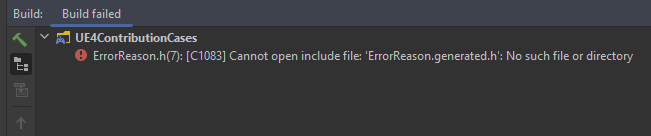
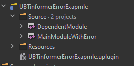

# An example of a completely non-informative error.

## Description 

There are several kinds of compilation errors about which UnrialBuildTool provides very little information. Moreover, according to this information, it is very difficult to find the cause and correct it. The file specified in the error is not the one in which the cause of the error lies.
I want to show an example of one of these types of error.

## Example

I got an example of such an error the other day. In isolated form, I reproduced it in this repository in the "UBTinformerErrorExapmle" plugin. Here is what Rider 2022.1 EAP 9 showed me
(which just parses the output of the UBT and renders it in the UI as a tree):



And this is how the full output of UBT looked like:

```
-------------------------------------------------------------------------------
--------------------Project: Default-------------------------------------------
MainModuleWithError.cpp (0:00.54 at +0:00)
0>C:\Dev\External\UE4ContributionCases\Plugins\UBTinformerErrorExapmle\Source\DependentModule\Example\ErrorReason.h(7): Error C1083 : Cannot open include file: 'ErrorReason.generated.h': No such file or directory

Error executing C:\EpicGames\UE_4.27\Engine\Build\Windows\cl-filter\cl-filter.exe (tool returned code: 2)
---------------------- Done ----------------------

    Rebuild All: 0 succeeded, 1 failed, 0 skipped

1 build system warning(s):
   - License is invalid

Build failed at 14:27:46 
```

**The main issue of the problem is that it is very difficult to understand from these messages where the error is located.**


If we look at the header file `DependentModule\Example\ErrorReason.h` pointed to by UBT and Rider IDE, we will see that it is absolutely correct.

```C++
// Note: 2. Create some class for the object. It must contain macros and include "*.generated.h".

#pragma once

#include "CoreMinimal.h"
#include "UObject/Object.h"
#include "ErrorReason.generated.h"

/**
 * Some class of object. Must contain macros and include "*.generated.h"
 */
UCLASS()
class DEPENDENTMODULE_API UErrorReason : public UObject
{
	GENERATED_BODY()
};

```

The error message is misleading:
```
Error C1083 : Cannot open include file: 'ErrorReason.generated.h': No such file or directory
```

### Culmination

Only if you pay attention to the line above the line with the error, and see when compiling what exactly the error occurred, then it becomes clear where to look for it:

```
MainModuleWithError.cpp (0:00.54 at +0:00)
```

But again, **from this message it is not at all clear what the reason is**. What line is the reason in? And even the file with the reason is not clear.

If we look into the header file `Source\MainModuleWithError\MainModuleWithError.h`, we will see that there is a forgotten include on the file that UBT and RiderIDE swear at.

```C++
#pragma once

#include "CoreMinimal.h"
// VVV
#include "DependentModule/Example/ErrorReason.h"
// ^^^
#include "Modules/ModuleManager.h"

class FMainModuleWithErrorModule : public IModuleInterface
{
public:

	/** IModuleInterface implementation */
	virtual void StartupModule() override;
	virtual void ShutdownModule() override;
};

```

Now let's pay attention to the dependencies of the modules:



Where "MainModuleWithError" is the main module (it has only UE4 modules as dependencies), and "DependentModule" is the module dependent on the "MainModuleWithError". These lines are in the file `DependentModule.Build.cs`:

```C#
		PublicDependencyModuleNames.AddRange(
			new string[]
			{
				"Core",
				// Note: 1. Including module dependency
				"MainModuleWithError" 
			}
			);
```

And if we remove the wrong `#include "DependentModule/Example/ErrorReason.h"` from the file `Source\MainModuleWithError\MainModuleWithError.h`, then everything will compile successfully.

## How did this case come about?

During the refactoring, it was decided to separate the logic into two different modules. I transferred part of the logic and classes to the dependent module, and apparently I accidentally missed the include and forgot to remove it.

I think this is a pretty common case.

## Summary

### Feature request for Unreal

There is a need to add more information about errors of this type, described above, to the output of UnrialBuildTool at compile time.

### Feature request for Rider

Add an underscore option to warn that the include file is in another module that is not listed in the current module's dependencies. Perhaps for the code inspector, or at least displaying the problem at compile time.

## Steps to reproduce

1. Make two independent modules.
2. In first of the modules create an Unreal class with macros and "*.generated.h"
3. In the second module, in any of the header files, include the file from point 2. As example:
> #include "FirstModule/Dir/SomeUnrealClass.h"

4. Try to compile the project.

### Expected Result

Compilation failed. The logs point to an error in the file from the second module and point to a line with an invalid include.

### Actual Result

Compilation failed. The logs point to an error in the header file of the Unreal class from the first module with the following message:
> Error C1083 : Cannot open include file: '*.generated.h': No such file or directory